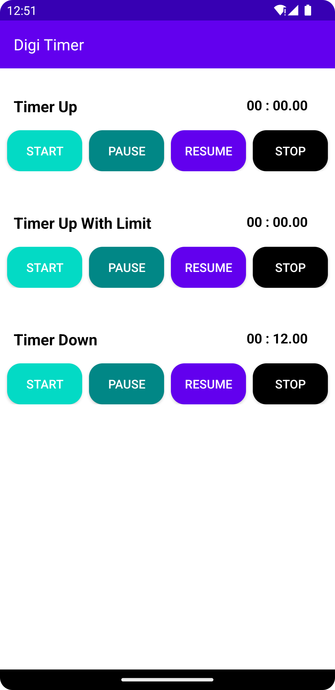

# Digi Timer- An Android Timer Logic Library
[](https://www.android.com)
[](https://android-arsenal.com/api?level=18)
[](https://jitpack.io/#hamidfathi1998/Digi-Timer)

<p align="left">
 <a></a>
</p>


## Prerequisites

Add this in your root `build.gradle` file (**not** your module `build.gradle` file):
```gradle
allprojects {
	repositories {
		...
		maven { url "https://jitpack.io" }
	}
}
```

## Dependency

Add this to your module's `build.gradle` file :

```gradle
dependencies {
	...
	implementation 'com.github.hamidfathi1998:Digi-Timer:$VERSION'
}
```

## Usage
We have three mode of timer in this library
* Timer Up
* Timer Up With Limit
* Timer Down

### MainActivity.kt
```kotlin
    companion object{
        const val TIMER_DOWN_LIMIT_VALUE = 12_000L // 12 sec
        const val TIMER_UP_WITH_LIMIT_VALUE = 70_100L // 1 min, 10sec, 10 mill
        const val TIMER_DATE_FORMAT_VALUE = "mm : ss.SS" // 12 : 25.79
    }
    
        //Initialize Timer with Timer up
        val mTimer = TimerFactory()
            .getInstance(TimerMode.TIMER_UP) // or Timer Down, Timer Up With Limit
            // .setLimitToTimer(TIMER_DOWN_LIMIT_VALUE) usage in Timer Down and Timer Up With Limit for set limit 
            .setDateFormatPattern(TIMER_DATE_FORMAT_VALUE)
            .timerTick { timerValue ->
                runOnUiThread {
                    binding.txtTimerUpValue.text = timerValue
                }
            }
        
        binding.btnTimerUpStart.setOnClickListener {
            mTimer.start()
        }

        binding.btnTimerUpStop.setOnClickListener {
            mTimer.stop()
        }

        binding.btnTimerUpPause.setOnClickListener {
            mTimer.pause()
        }

        binding.btnTimerUpResume.setOnClickListener {
            mTimer.resume()
        }

```

Another method :
```kotlin
    val mTimer = TimerFactory()
    .getInstance(TimerMode.TIMER_DOWN) // or Timer Down, Timer Up With Limit
    .setLimitToTimer(8_000) usage in Timer Down and Timer Up With Limit for set limit 
    .setDateFormatPattern(TIMER_DATE_FORMAT_VALUE)
    if you want when tap on stop method invoke finishTimer method pass treu ( default value is false)
    .setTapStopFinishInvoke(true)
    .timerTick { timerValue ->
        runOnUiThread {
            binding.txtTimerUpValue.text = timerValue
        }
    }
    
    // get timer value if you want to use timer value another place
    mTimer.getTimerNowValue()
    
    // To avoid MemoryLeaks always stop the timer in onDestroy().
    mTimer.destroyTimer()
    
    
```


## If this project helps you in anyway, show your love :heart: by putting a :star: on this project :v:

## Contributing

Please fork this repository and contribute back using
[pull requests](https://github.com/hamidfathi1998/DigiTimer/pulls).

Any contributions, large or small, major features, bug fixes, are welcomed and appreciated
but will be thoroughly reviewed .

### - Contact - Let's become friend
- [Github](https://github.com/hamidfathi1998)
- [Linkedin](https://www.linkedin.com/in/hamidfathi1998/)

